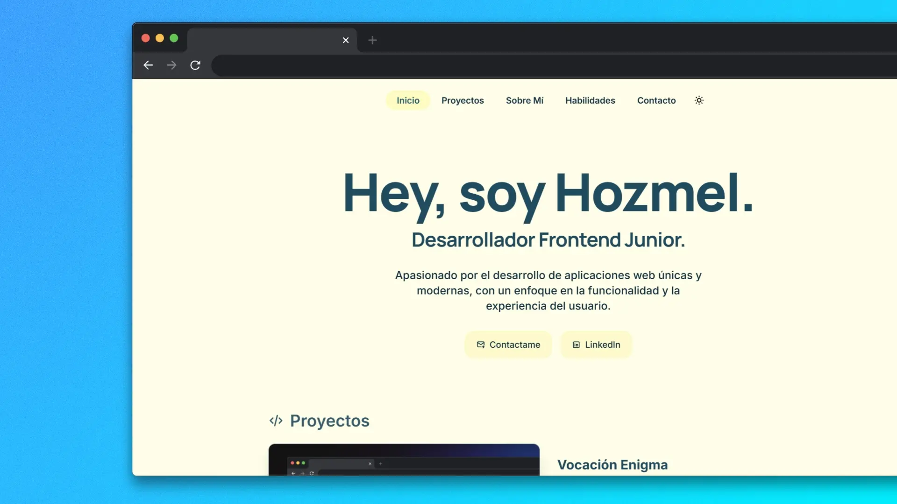

# Portfolio - Hozmel de la Rosa

<!-- 
 -->

<!-- 
 -->

¡Hola! 👋 Soy **Hozmel de la Rosa**, Licenciado en Ciencias y Tecnologías de la Información, apasionado por el desarrollo web con un enfoque especial en **Frontend**.

Este es mi portfolio personal donde muestro mis proyectos, habilidades y el trabajo que he realizado mientras continúo creciendo profesionalmente en el mundo del desarrollo web.

## 💻 Sobre Este Proyecto

Portfolio desarrollado desde cero para mostrar mi trabajo y habilidades técnicas de manera profesional y moderna. El sitio incluye:

- 🎨 Diseño moderno y responsive
- 🌙 Modo claro/oscuro
- 📱 Optimizado para todos los dispositivos
- ⚡ Rendimiento optimizado
- 🎯 Secciones: Inicio, Proyectos, Sobre mí, Habilidades

## 🛠️ Stack Tecnológico

- **Astro** - Framework web moderno
- **Tailwind CSS** - Estilos y diseño
- **TypeScript** - Tipado estático

## 📫 Contacto

Si quieres conocer más sobre mi, puedes contactarme mis enlaces de redes sociales en el portfolio.

---

Desarrollado con ❤️ y 🥰
